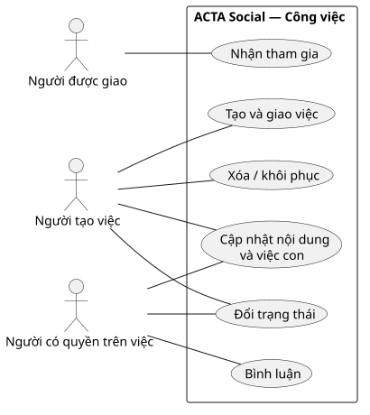
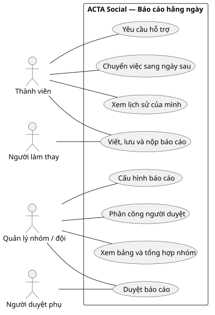
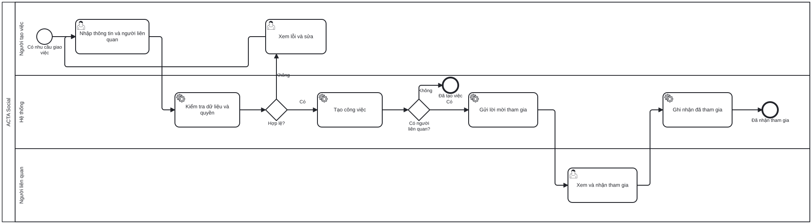
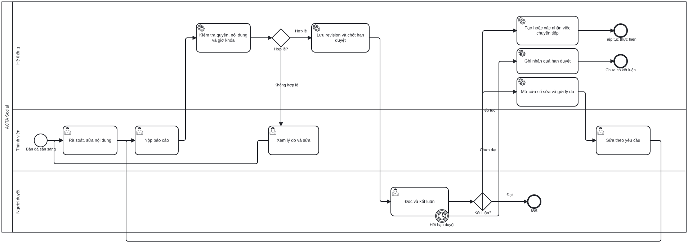

# 05 — Mô hình Công việc và Báo cáo hằng ngày

> Bản 0.2 · Đối chiếu chức năng hiện tại ngày 19/09/2026. Mỗi hình trả lời một câu hỏi riêng. Tên entity/field giữ theo hệ thống để dev đối chiếu; đoạn văn ngay dưới giải thích bằng ngôn ngữ nghiệp vụ.

**Cách đọc nhanh:** Use Case cho biết *ai làm được gì*; BPMN cho biết *ai thực hiện bước nào, khi nào rẽ nhánh*; sơ đồ trạng thái cho biết *một đối tượng đổi trạng thái ra sao*; ERD cho biết *dữ liệu nào được lưu và liên hệ với nhau*. Trong BPMN, mỗi hàng là một người hoặc hệ thống, hình chữ nhật là việc cần làm, hình thoi là câu hỏi rẽ nhánh, hình tròn là điểm bắt đầu/kết thúc.

## 1. Ai dùng những chức năng nào? — UML Use Case

### Công việc

Người tạo việc có thể tạo, giao và quản lý việc mình có quyền. Người được giao cần **nhận tham gia** nếu lời mời đang chờ. Người có quyền trên việc có thể cập nhật, bình luận hoặc đổi trạng thái theo điều kiện API. Hình cho biết **vai trò tham gia chức năng**; quyền với một task cụ thể vẫn được kiểm riêng.

### Báo cáo hằng ngày

Thành viên viết báo cáo và xem lịch sử của mình. Quản lý cấu hình báo cáo, xem bảng nhóm và phân công người duyệt. Người duyệt phụ chỉ duyệt những thành viên được phân công. Người làm thay chỉ nộp hộ khi quan hệ làm thay hợp lệ; họ không nhận quyền quản lý.

Nguồn chỉnh sửa: [Use case Công việc](./diagrams/task-use-cases.puml), [Use case Báo cáo](./diagrams/report-use-cases.puml).

## 2. Quy trình thực hiện thế nào? — BPMN 2.0

### 2.1. Tạo và giao công việc

Người tạo nhập thông tin và chọn người liên quan. Hệ thống kiểm dữ liệu/quyền rồi tạo công việc. Người tạo việc thường là người phụ trách chính; khi quản trị tạo việc, quản trị có thể chọn người phụ trách chính. Nếu có **người liên quan**, hệ thống tạo lời mời và gửi thông báo; từng người xem rồi xác nhận tham gia. Hàng “Người liên quan” trong hình đại diện cho **mỗi người được mời**; một việc có thể có nhiều lời mời. Nếu không có người liên quan, quy trình tạo việc kết thúc ngay. **Xác nhận tham gia chỉ đổi trạng thái lời mời**, không tự chuyển công việc sang “Đang làm”. Công việc sau đó được cập nhật theo các thao tác riêng nêu ở mục 3.

[Mở BPMN tạo và giao công việc để chỉnh sửa](./diagrams/task-create-assign.bpmn).

### 2.2. Nộp và duyệt báo cáo

Ba lane là **Thành viên**, **Hệ thống**, **Người duyệt**. Điểm bắt đầu là một bản báo cáo đã được chuẩn bị. Lịch sinh lúc 07:30, nhắc nộp và gửi tổng hợp 17:20 là các lịch vận hành riêng, không bị vẽ như các bước bắt buộc nối tiếp của một lần nộp.

1. Thành viên rà soát nội dung và bấm Nộp. Hệ thống kiểm quyền, câu trả lời và giờ khóa. Nếu chưa hợp lệ, thành viên xem lý do rồi sửa.
2. Nếu hợp lệ, hệ thống lưu **một lần nộp** và chốt hạn duyệt. Người duyệt đọc bản báo cáo.
3. **Đạt:** kết thúc lượt duyệt. **Tiếp tục thực hiện:** hệ thống tạo hoặc xác nhận việc cần chuyển sang ngày sau. **Chưa đạt:** hệ thống cấp thời hạn sửa; thành viên sửa và nộp lại, tạo lần nộp mới.
4. Hết hạn duyệt mà chưa có kết luận thì hệ thống ghi nhận quá hạn. Đây không phải kết luận “Chưa đạt” của thành viên.

[Mở BPMN nộp và duyệt báo cáo để chỉnh sửa](./diagrams/daily-report-review.bpmn).

## 3. Trạng thái nào thuộc đối tượng nào?

### Công việc và lời mời tham gia là hai thứ độc lập

| Đối tượng | Trạng thái lưu | Ví dụ |
| --- | --- | --- |
| Công việc | `pending`, `in_progress`, `done`, `cancelled` | Việc “Làm báo giá” còn `pending` cho tới khi người có quyền đổi trạng thái |
| Người được giao | `pending`, `accepted` | An đã bấm “Nhận tham gia”, lời mời thành `accepted`; công việc vẫn có thể `pending` |
| Xóa mềm công việc | `deletedAt` có/không | Đưa việc vào thùng rác không đồng nghĩa chuyển sang `cancelled` |

Khi người dùng tạo việc, trạng thái mặc định là `in_progress`; họ có thể chọn `pending`. Việc do quản trị tạo bắt đầu ở `pending`. API cập nhật hiện nhận một trong bốn trạng thái khi người thao tác có quyền; hệ thống **không bắt buộc** đi lần lượt qua mọi trạng thái. Khi chuyển vào `done`, hệ thống ghi người/thời điểm hoàn thành; khi rời `done`, các mốc đó được xóa. Lời mời tham gia của người liên quan chỉ đi từ `pending` sang `accepted` khi được nhận.

### Báo cáo và kết luận duyệt cũng độc lập — UML State

[Nguồn sơ đồ có thể chỉnh sửa](./diagrams/report-status.mmd)

Một bản báo cáo có thể được nộp nhiều lần. Mỗi lần nộp tạo một **revision**; một revision có tối đa một kết luận: **Đạt**, **Tiếp tục thực hiện** hoặc **Chưa đạt**. Ví dụ, lần nộp thứ nhất bị trả, báo cáo chuyển `REOPENED`; thành viên sửa và nộp lần thứ hai thì báo cáo lại `SUBMITTED`, còn lịch sử lần đầu vẫn giữ nguyên.

“Không nộp”, “đã khóa” và “quá hạn duyệt” là cách hệ thống **hiển thị/tính toán**, không phải ba giá trị mới của `DailyReport.status`. Hết hạn duyệt không tự tạo kết luận thay người duyệt.

## 4. Dữ liệu Công việc liên quan nhau thế nào? — ERD Crow's Foot

[Nguồn sơ đồ có thể chỉnh sửa](./diagrams/task-erd.mmd)

**Ví dụ đọc:** một công việc có thể giao cho nhiều người qua nhiều dòng `BUSINESS_FORM_TASK_ASSIGNMENT`; mỗi dòng ghi người đó đang chờ hay đã nhận. Công việc cũng có nhiều hoạt động như bình luận hoặc đổi trạng thái. `TASK_ASSIGN_GROUP` là danh sách người để giao nhanh; **không có quan hệ lưu trực tiếp từ nhóm tới task**. Khi chọn nhóm, hệ thống chép người trong nhóm vào danh sách được giao của task.

## 5. Dữ liệu Báo cáo liên quan nhau thế nào? — ERD Crow's Foot

[Nguồn sơ đồ có thể chỉnh sửa](./diagrams/report-erd.mmd)

**Ví dụ đọc:** một người trong hai phạm vi sẽ có **hai bản báo cáo riêng** cùng ngày. Mỗi bản có nhiều câu trả lời; bản lưu mã phiên bản bộ câu hỏi để lịch sử không đổi khi quản lý sửa câu hỏi về sau. Mỗi phạm vi gắn **hoặc** nhóm giao việc **hoặc** đội/phòng ban, không gắn cả hai cùng lúc. Quy tắc “đúng một” được kiểm ở nghiệp vụ.

## 6. Một lần nộp và việc chuyển tiếp được lưu ra sao? — ERD Crow's Foot

[Nguồn sơ đồ có thể chỉnh sửa](./diagrams/review-erd.mmd)

**Ví dụ đọc:** báo cáo của An nộp lần 1 và lần 2 là hai `DAILY_REPORT_REVISION`. Mỗi lần có hạn duyệt riêng và tối đa một kết luận. Một dòng chuyển tiếp luôn có báo cáo nguồn và ngày đích; nó có thể do người duyệt tạo (`reviewId` có giá trị) hoặc thành viên tự kéo (`reviewId` rỗng). Nếu người duyệt xác nhận lại một dòng đã tồn tại, `confirmedByReviewId` lưu lượt xác nhận mà không tạo dòng trùng. `taskId` là mã tham chiếu mềm: việc nhập tay có thể không gắn task. `chainId` theo dõi cùng một việc qua nhiều ngày.

## 7. Chú giải và phạm vi của ERD

`PK` là mã định danh của một dòng; `FK` là mã trỏ sang entity khác; `UK` là giá trị không trùng. `||` nghĩa là đúng một, `o|` là không hoặc một, `o{` là không hoặc nhiều. Đường liền là quan hệ mà mã cha nằm trong khóa của dòng con; đường chấm là quan hệ còn lại. Các field và bảng ít ảnh hưởng đến câu chuyện chính (KPI, nhóm duyệt, tệp, thông báo) có trong [Data Dictionary](./02-data-dictionary-erd.md) và schema, để hình dễ đọc.

Nguồn đối chiếu: [schema Công việc](../../../../../acta-servers/acta-main-server/prisma/schema/business-form.prisma), [schema Nhóm giao việc](../../../../../acta-servers/acta-main-server/prisma/schema/task-assign-group.prisma), [schema Báo cáo](../../../../../acta-servers/acta-main-server/prisma/schema/daily-report.prisma). Ký pháp tham khảo: [BPMN 2.0.2 (OMG)](https://www.omg.org/spec/BPMN/), [UML 2.5.1 (OMG)](https://www.omg.org/spec/UML/2.5.1), [ERD Crow's Foot trong Mermaid](https://mermaid.js.org/syntax/entityRelationshipDiagram).
